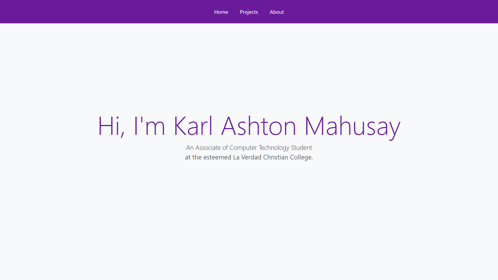
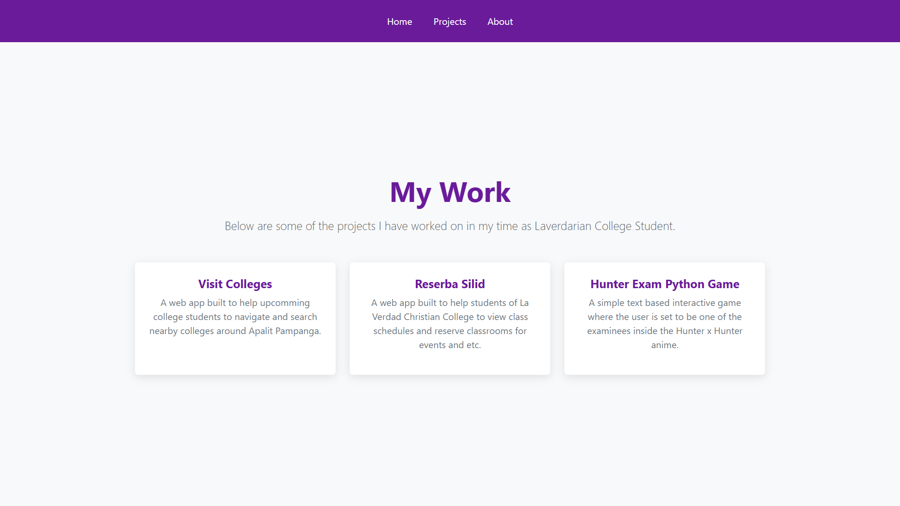
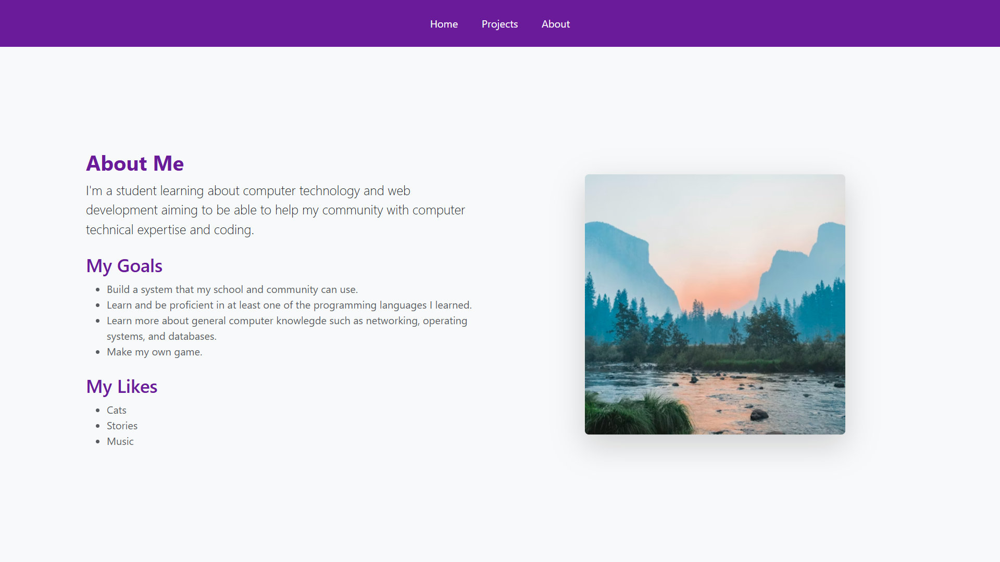

# 📁 Personal Portfolio (Laravel)
A simple static website containing information about myself.

# 📖 Description
This is an activity in our Web Development 2 navigating on how we can apply our learned knowledge on laravel controllers, routes, blade templates and basic web development (HTML, CSS and Bootstrap).

# 🖼️ Gallery
**Main Portfolio Page**

This shows a simple landing page, it took inspiration from the windows 10 installation.



**Sub-page 1: Projects page**

This page shows the list of my group programming projects.



**Sub-page 2: About me page**

This page shows the information about myself, it includes my goals and my likes.



# 🚀 Getting Started

Follow these steps to get a local copy of the project up and running on your machine.

## Installation
1. **Clone the repository**
    ```
    git clone https://github.com/your-username/your-repo-name.git
    ```
2. **Navigate to the directory**
    ```
    cd your-repo-name
    ```

3. **Install dependencies**
    ```
    npm install
    ```

4. **Run the development server**
    ```
    npm run dev
    ```

